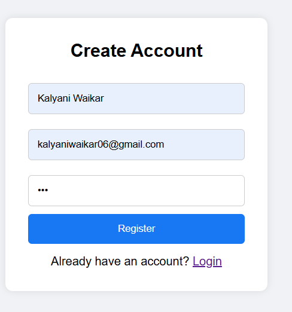
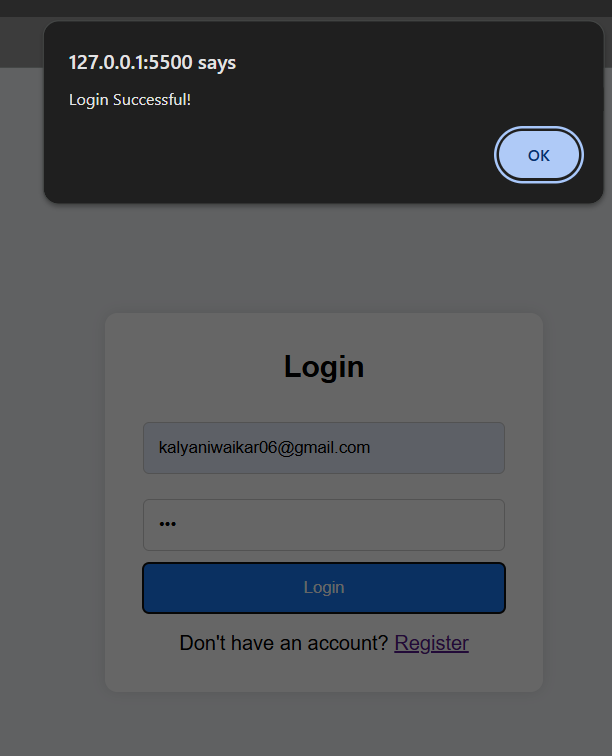
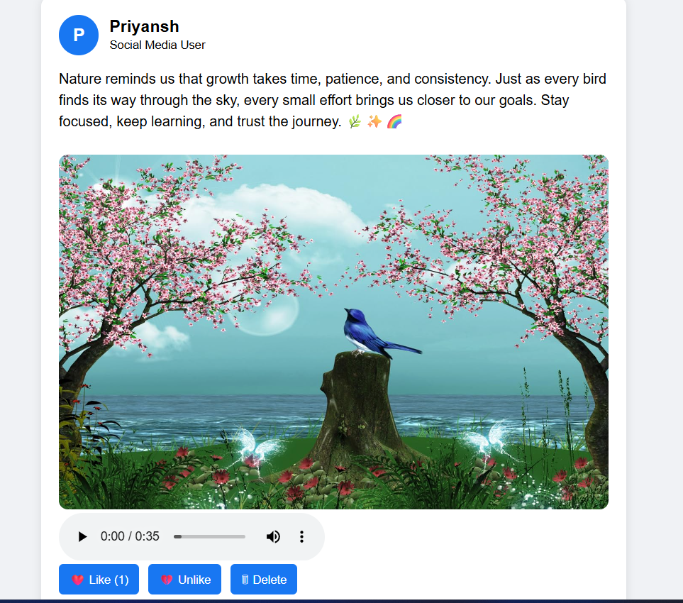
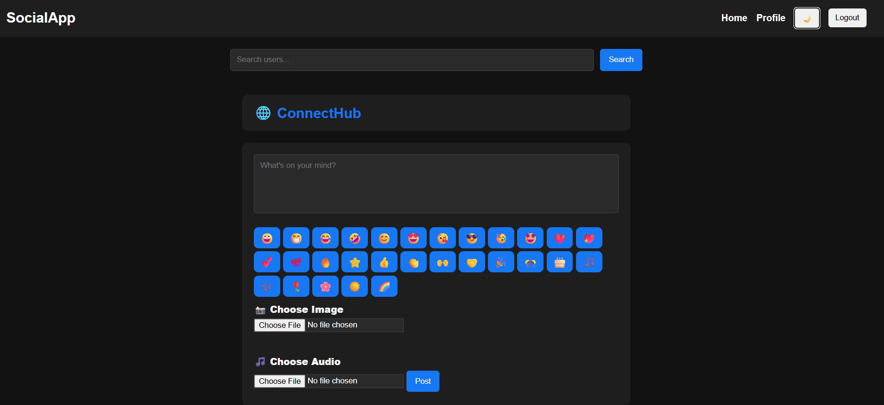
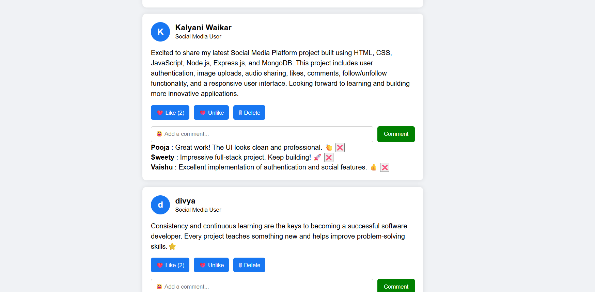
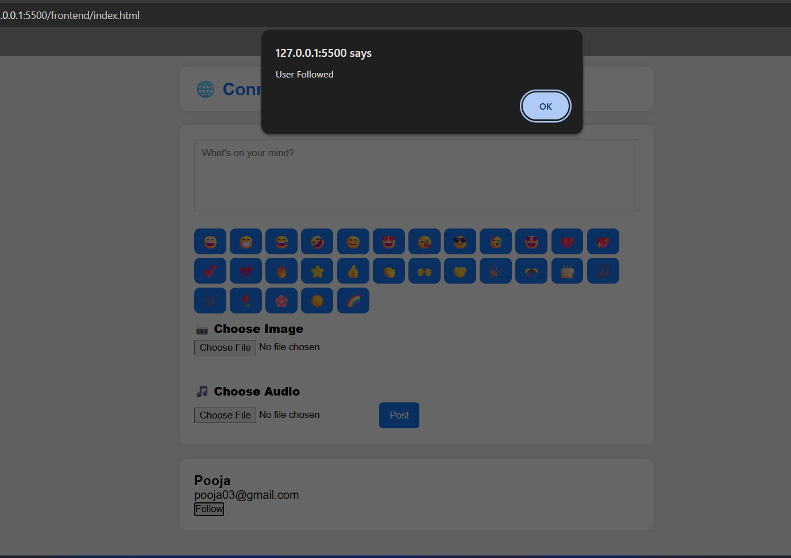
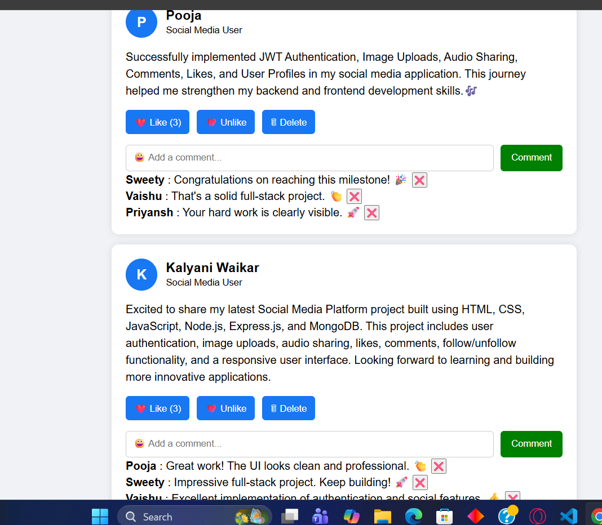

# CodeAlpha Social Media Platform

## Project Overview

A full-stack Social Media Platform developed as part of the CodeAlpha Internship Program. The application allows users to register, log in, create posts, upload images and audio, like/unlike posts, comment, follow other users, and manage their profiles.

## Features

* User Registration and Login
* JWT Authentication
* Create and Delete Posts
* Image Upload
* Audio Upload
* Like and Unlike Posts
* Comment on Posts
* Follow and Unfollow Users
* User Profile Page
* Followers and Following Count
* User Search
* Dark Theme Support
* Responsive User Interface

## Technologies Used

### Frontend

* HTML
* CSS
* JavaScript

### Backend

* Node.js
* Express.js

### Database

* MongoDB

### Authentication

* JWT (JSON Web Token)

### File Upload

* Multer

## Project Structure

frontend/

* index.html
* login.html
* register.html
* profile.html
* css/style.css
* js/auth.js
* js/post.js
* js/profile.js

backend/

* models/
* routes/
* middleware/
* config/
* uploads/
* server.js

## How to Run

1. Install dependencies

npm install

2. Start backend server

node server.js

3. Open frontend files using Live Server

## Screenshots

### Register Page

### Login Page

### Home Feed

### Create Post

### Profile Page

### Dark Mode

### Comment Feature

### Follow Feature

### Like / Unlike Feature

## Author

Kalyani Waikar

## Internship

CodeAlpha Internship Project

